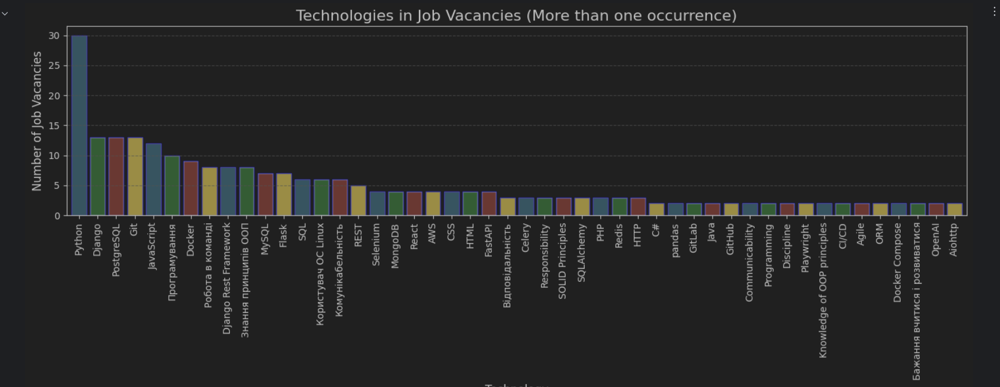
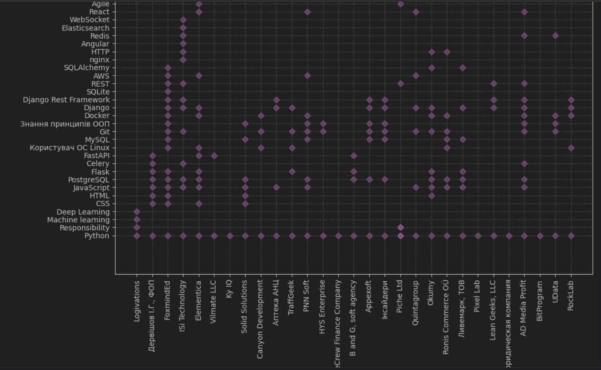
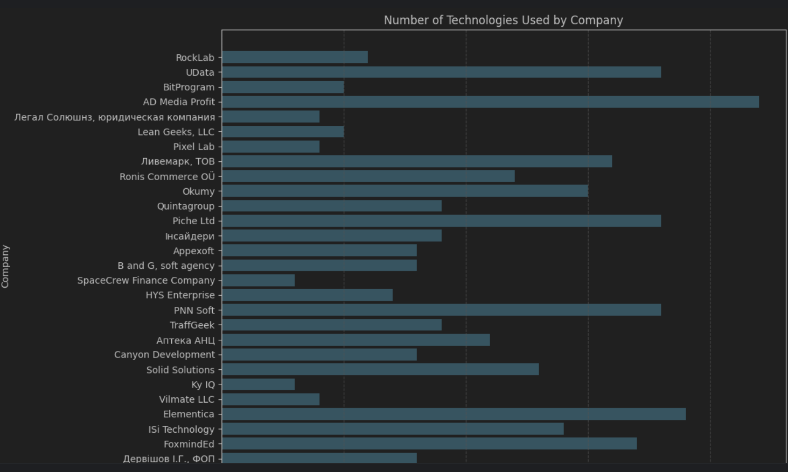
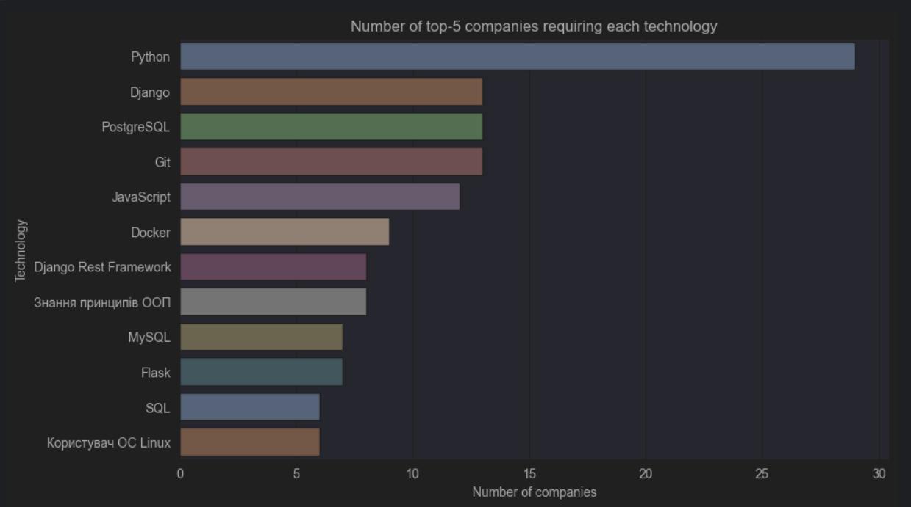
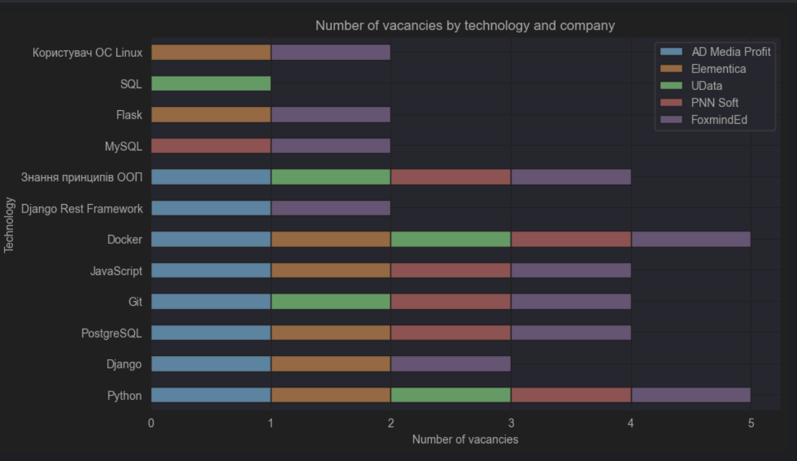

# Scrapy Job Positions Analysis

This repository contains two Python scripts for scraping job positions from a website and analyzing the required technologies by different companies.

## Web Scraping Script

The `positions.py` script uses Scrapy to scrape job positions from [work.ua](https://www.work.ua/jobs-python+developer/) website. It extracts information such as job title, company name, salary, description, and required technologies for each job position.

## Analysis Script

The `analysis.py` script analyzes the scraped job positions. It performs the following tasks:

1. Separates technologies for most wanted and unpopular.
2. Displays the most popular technologies using bar plots.
3. Displays unpopular technologies using pie charts.
4. Generates a word cloud of technologies with one-time occurrence.
5. Analyzes which technologies each company requires from job applicants.
6. Visualizes the number of technologies used by each company.

## Requirements

To run the scripts, you need to install the following Python libraries:

- Scrapy
- Pandas
- Matplotlib
- Seaborn
- WordCloud
- Jupyter Notebook

### Results
The analysis provides insights into the most wanted technologies by companies and the technologies required by each company.

